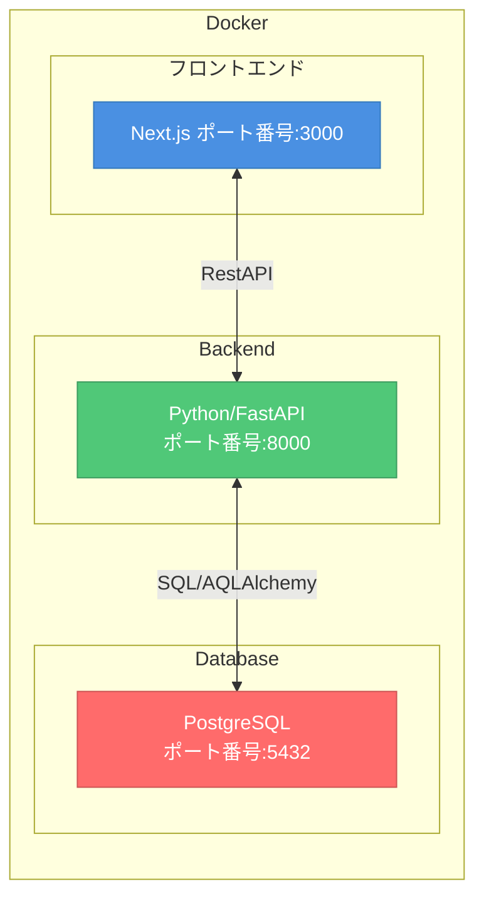

# 要件定義書

## 0.作るものを整理する（5W1H）

| 5W1H | 整理すること |
| ---- | ---- |
| Who（誰が） | ・新卒就活中の大学生 ・複数社の選考を同時進行している人 ・スケジュール管理よりタスク管理を重視したい人 |
| What（何を） | ・企業の登録とフェーズ管理 ・全てを含めた日程と優先順位管理 ・企業ごとの詳細情報についてまとめる機能 |
| When（いつまでに） | とりあえず早め早めに進めたい。夏休み前にあらかたの構築を終えられたら嬉しいかな |
| where（どこまで） | とりあえず、外部のインターフェイスとの連携はまだ考えず、機能要件を満たすことに注力したい。詳しくはスコープに記載。 |
| Why（なぜ） | ・就活状況を管理するためのto doリストアプリはなく、既存のものはカレンダーアプリに寄っている（tomolog） ・Notionやスプレットシートでの管理は、限界があるし、それ用じゃないので面倒臭さが残る。 ・カレンダーアプリはtodoリストではないため、普段の予定とごっちゃになって散らかり気味になる。 |
| How（どうやって） | ・バックはFastAPIを使いつつ、データベースはORMライブラリを使用 ・フロントはNextで実装する予定 |

## 1.概要

### 1-1.システム構成図

### 1-2.背景

1. 現状（今どういう状況か）
- ESや応募企業内容をNotionで管理。
- 面接日程やES締切日をカレンダーで管理。
- to doリストは不使用。
2. 課題（何が問題か）
- 就活関連の情報が二のアプリに散らばっており、カレンダー単体ではto doリスト足りえないが、to doリストを入れると認識負荷が非常に高まる
- 応募企業の状況管理にはExcelが適しているが、既にNotionとカレンダーを使っており、ツールをさらに増やすことで認知負荷が上がるため採用しない。
- カレンダーでの登録が全て同一企業でも、企業名から何の予定かを書くのが手間
3. 既存サービスの限界（なぜ既存ので解決できないか）
- 既存の就活アプリ、（Tomolog）はカレンダー要素が強く、to doリストではない
- 既存のto doリスト（Notion等）では認知負荷の改善はされない
4. 解決策（だからこれを作る）
- 就活関連のto doやカレンダー情報をこのアプリだけで完結して見れるようにする。

### 1-3.用語定義
なし

## 2.スコープ

### 2-1.対象範囲（作るもの）
- 企業登録（POST）用のAPI
- 企業情報取得（GET）用のAPI
- 表示画面
### 2-2.対象外（作らないもの）
- 細かなデザイン
- 他登録、表示機能
- to doリストとしての機能
## 3.機能要件

### 3-1.機能一覧
- FastAPI
  - 企業登録用（POST）用のAPI
  - 企業情報取得（GET）用のAPI
- Next.js
  - 登録用画面
  - 表示用画面
### 3-2.画面一覧
・登録画面
・表示画面

## 4.データモデル

### 企業テーブル

| id | company_name | created_at |
| -- | -------- | ----- |
| 01 | hogehoge | year/month/day/time

## 5.非機能要件

### 5-1.技術スタック
- backend
  - FastAPI
    - モダンなライブラリということで、使い方を改めて学ぶのに適したものだと考えた。また、docsの自動生成機能なども初学者である自分にはすごくありがたいものかと思った。
  - PostgreSQL
    - 今回のアプリケーションレベルであれば、sqliteなどのレベルで問題ないと考えたものの、実践的な技術スタック。学ぶことで成長できる分野の言語を用いたく、PostgreSQLであればDockerを使ったりといった工程を踏まないといけないため、今回はピックアップした。
  - ORMライブラリ
    - Tortoise-ORM
      - 調べたところ、SQLAlchemyはFastAPIとの相性が非常に良いとあったが、先輩の教えてくださったこちらのライブラリの方が適していると思った。
      - また、パフォーマンスも高く、学習コストもSQLAlchemyよりも低いとあったので、変更を決めた。

- frontend
  - Next.js
    - 今回のアプリケーションでは、Reactについてきちんと学びたい。サーバーサイド、クライアントサイドの分け方などの詳しい基本理念も含めて勉強したいと思った。
    - そこで、ReactのフレームワークであるNextを使ってアプリケーションを作り上げていこうと考えた。

### 5-2.セキュリティ方針
- データベース
  - SQLインジェクション対策（ORMライブラリ使え）
  - XSS対策（FastAPIのPydatic等やれることはある）
    - 詳しくは[セキュリティ対策記事](https://zenn.dev/fumi_mizu/articles/9d959aa2d6ebe3)
### 5-3.対応ブラウザ
- Google Chrome 最新版
- Safari 最新版
